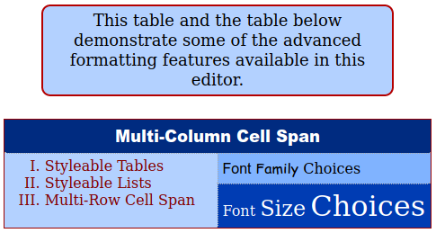

# Kei-HTML-Editor
Pure Javascript HTML Editor. Can be run by downloading the project then clicking on the index.html file.

Tested - and working really well - in Chrome, Safari, Edge, and Firefox.

A working copy of this editor can also be viewed at http://orchardguides.com/KeiEditor/

Small, but remarkably powerful, this stand-alone word processor was designed to be dropped into web pages with a minimum of effort.

Lots of good folks have written simple editors that take advantage of the JavaScript execCommand to compose and format HTML documents. This project goes well beyond the capabilities of these other tools by using specialized JavaScript functions to create richly styled CSS documents with Tables, Lists and lots of other elements. All of which was implemented in less than 1,400 lines of JavaScript, CSS, and HTML code.

And undo/redo works with everything.

Improvements to the code base are welcome and encouraged.

  

